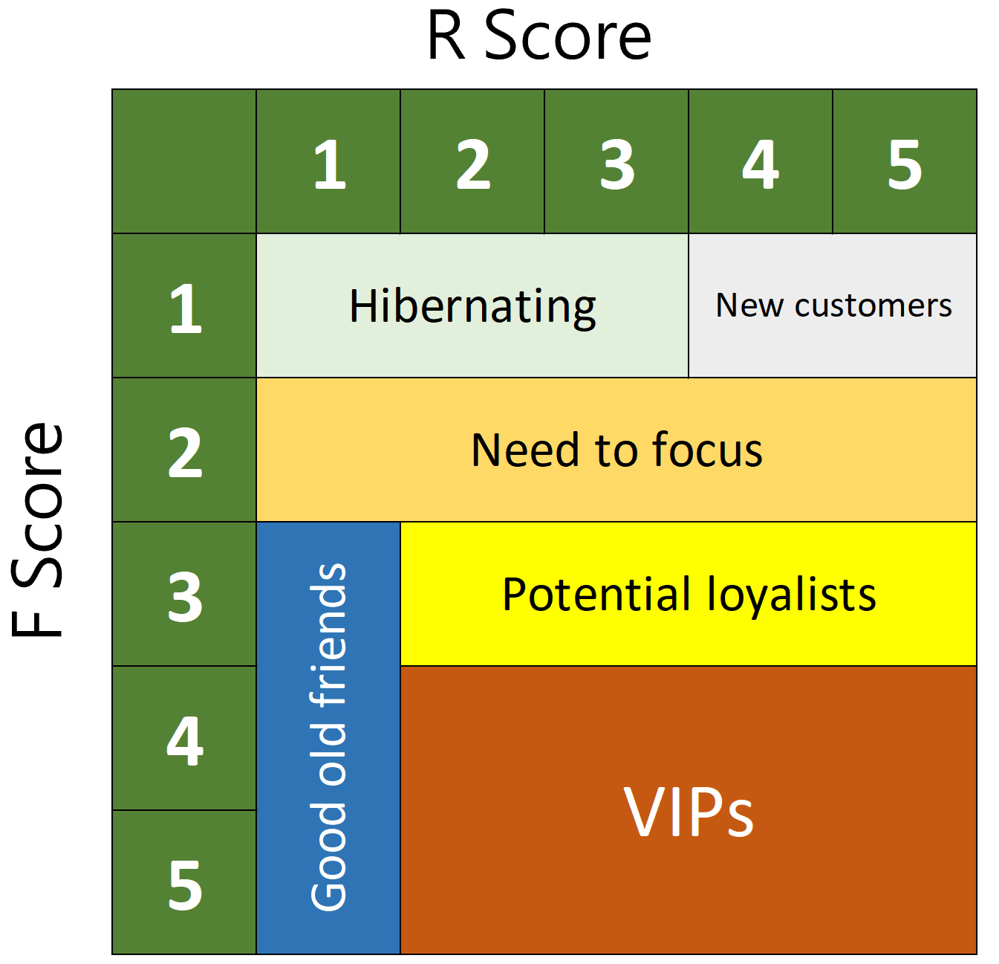
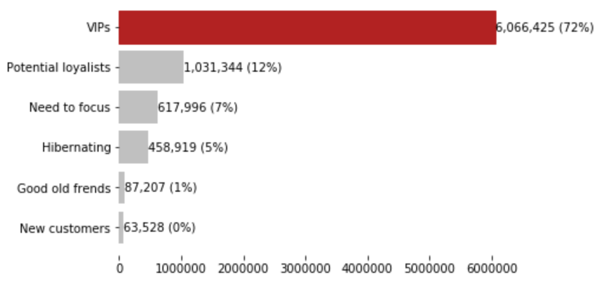

# Online Retail

## Dataset
The source of the dataset [Online Retail Data Set](https://archive.ics.uci.edu/ml/datasets/Online+Retail#) is from UCI Machine Learning Repository

### There are two parts of the analysis
1. Customer segmentation using RFM
2. Recommendation system using user-based implicit collaborative filtering

### Part 1: RFM Analysis
 - I am using RFM (Recency, Frequency, Monetary) analysis with 5x5x5 dimensions.
 - If customers have similar RFM scores, they behave similarly.
 - For the convenience of the marketing campaign, I group similar R-F scores to build marketing groups.

**Results:**

It might not be practical to work on 5x5x5 = 125 RFM group individually. Some groups are too small, so it is hard for marketers to work on too many groups. Therefore, we combine some of the groups based on their RFM properties. We further assign customer segmentation for marketing purposes to give the marketers a clear goal to work on.

#### Segment Description
- VIPs: For those whose recent purchases are within 180 days and have bought more than 5 times in a year.
- Potential loyalists: For those whose recent purchases are within 180 days and have bought 3-4 times in a year.
- Need to focus: For those who have bought only 2 times in the past year.
- Good old friends: For those who have bought more than 3 times didn't purchase within 180 days.
- New customers: For those who have only purchased once and their recent purchase is less than 30 days.
- Hibernating: For those who have only purchased once, and their recent purchase has been more than 30 days.

#### Actions
- VIPs: Keep them happy (at any cost).
- Potential loyalists: Should give incentives to increase their tendency to buy more times on the website.
- Need to focus: They have moderate monetary contributions, but the marketer should turn them in the potential groups ASAP; otherwise, they may turn to hibernate.
- Good old friends: They were loyal, but it seems we are losing them. Give them incentives to recall their good memories (recommendation comes in because we have their purchase history) and make them have a recent purchase.
- New customers: Make them want to purchase the second time; otherwise, they'll go hibernating.
- Hibernating: We don't know them much, and they didn't purchase within a month. We need to guess to motivate them to buy another time.

#### Short Summary
1. High-frequency buyers (especially F-score = 5, frequency > 6/year) contribute the most to the company.
2. High frequency and most recent buyers (high F and R scores) are the ones we should definitely keep.
3. Medium Frequency (F-score = 3) are the groups we want to save (give incentives), especially for those ones who have R-score > 2.
4. The number of new customers is quite low, so the company should lunch some customer acquisition campaigns.
5. There are quite some low frequency and low recency score buyers, which means the customers may lose interest in the website or products. The company should dive deep to investigate and save this group because new customer acquisitions are expensive.

6. VIPs are the champian, which contributes the most, but it only contributes 25% of our total customers.
7. Hibernating group has a lot of people (28%). Although they didn't make any recent purchase within 180 days, it accumulated moderate income. However, since we don't know them much, it's better to investigate why they only purchased once and left.
8. We don't see many new customers joining in (4%), so the customer base is relatively stable.
9. It's good to see we don't have too many people in the "Good old friends" group, which means those who purchased more than three times tend to stay and keep buying within 180 days cycle.

#### Possible Improvements
- RFM offers an intuitive way for segmentation, i.e., recency, frequency, and monetary values of the customers, which is easy to interpret by marketers. Marketers may use other techniques in customer segmentation such as K-means clustering, random forest. However, they are computationally expensive and hard to update the model on the fly. Therefore, for simplicity, the RFM model is still powerful in most cases.
- The models can be more complex if we have more data, such as users' demographic data. Then, demographic, psychographic, behavioral, and geographic segmentation can come into play.
- If we can run campaigns by preset AI, then we can have granular segmentation. Otherwise, we want to keep the numbers of the segments that can be run and controlled by marketers.

### Part 2: Recommender Systems

Collaborative filtering (CF) is taking users' ratings to catalog items (implicitly or explicitly). The basic assumption of collaborative filtering is that customers who had similar tastes in the past will have similar tastes in the future.

Since we don't have the ratings or likes in this data set, instead of using explicit collaborative filtering, we need to use implicit collaborative filtering. Implicit collaborative filtering uses data with non-obvious features, such as clicks, views, or purchases, which is the case of this dataset.

Ref: "Collaborative Filtering for Implicit Feedback Datasets" by Hu, Koren, and Volinsky.

I useed implicit collaborative filtering models created by [Ben Frederickson](https://github.com/benfred/implicit). It reports the top 10 recommendation items.

Let's pick 3 random customers and take a look.

### Note

Step-by-step python anlaysis and discussions can be found (here](retail.ipynb) 
